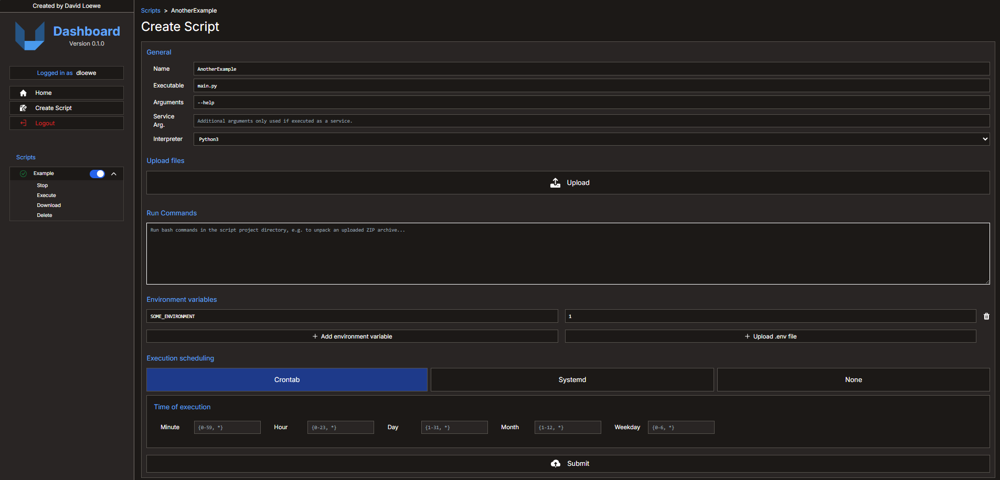
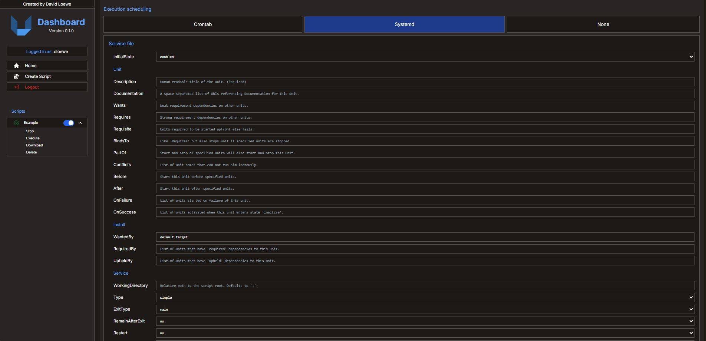
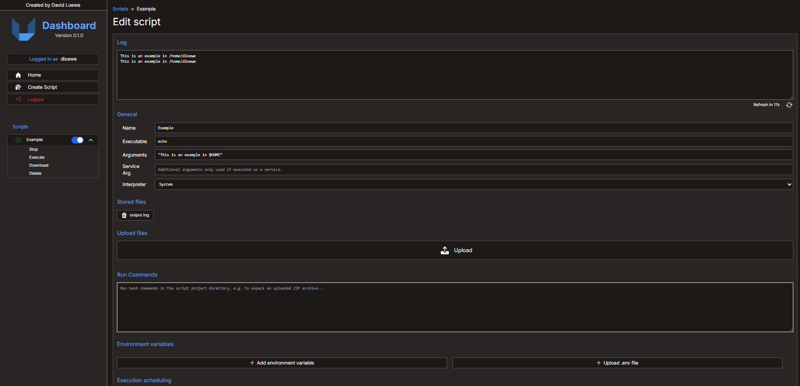

# Introduction

This repository contains a simple script management dashboard created using [Flask](https://flask.palletsprojects.com/en/3.0.x/) and [Tailwindcss](https://tailwindcss.com/). It's main purpose is to allow to easily install and monitor scripts on a given host with `crontab` or `systemd` integration without the need to use `ssh` and `scp` to deploy anything.

## Quickstart

Just follow these steps to host the service (**don't make it publicly available**):

1. Checkout the repository: `git clone https://github.com/TumbleOwlee/script-dashboard.git`
2. Generate certificate: `openssl req -x509 -newkey rsa:4096 -nodes -out certificate/cert.pem -keyout certificate/key.pem -days 365`
3. Start the service: `flask --app main --debug run -h 0.0.0.0 -p 5000 --cert certificate/cert.pem --key certificate/key.pem`

Exchange the values for host and port as required. Also if available and possible, use a non-self-signed certificate. Preferably you also switch to a production ready web server as e.g. [Gunicorn](https://flask.palletsprojects.com/en/3.0.x/deploying/gunicorn/) or [Waitress](https://flask.palletsprojects.com/en/3.0.x/deploying/waitress/).

**DO NOT USE THE TEST CERTIFICATES OF THIS REPOSITORY!**

Additionally, you can run it as a `systemd` managed service using the provided service file template. Just exchange the working directory entry for a valid one and place it in `/etc/systemd/system/`.

## Authentication

Currently this service uses PAM and thus the simple Unix accounts for authentication. It doesn't use a self maintained database or anything else. Since that's the case, the service has to be executed as `root`. That's a limitation that may be changed in the future but for now that the easiest way to implement account handling. Since users can upload any scripts, the service only executes the provided script as the user itself, **never** as `root`.

## Scheduling

Currently `crontab` and `systemd` are supported for execution handling. Besides that the `None` option is also provided for all scripts that either only have to be executed once on trigger by the user or scripts that implement the execution scheduling in itself.

## Illustations

These images may not be up-to-date.

### Login Page

### Create Script

### Configure Systemd

### Edit Script

### NotFound Page

